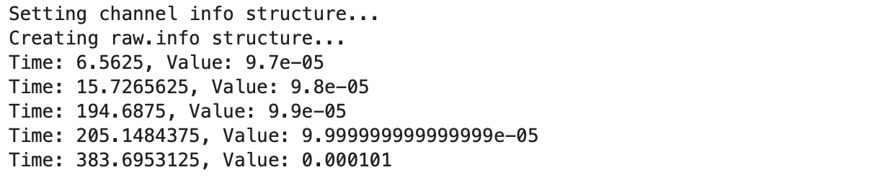
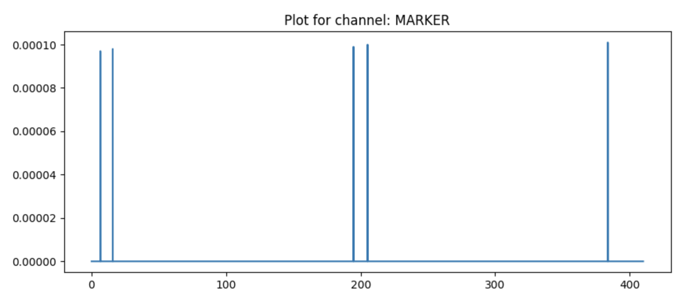
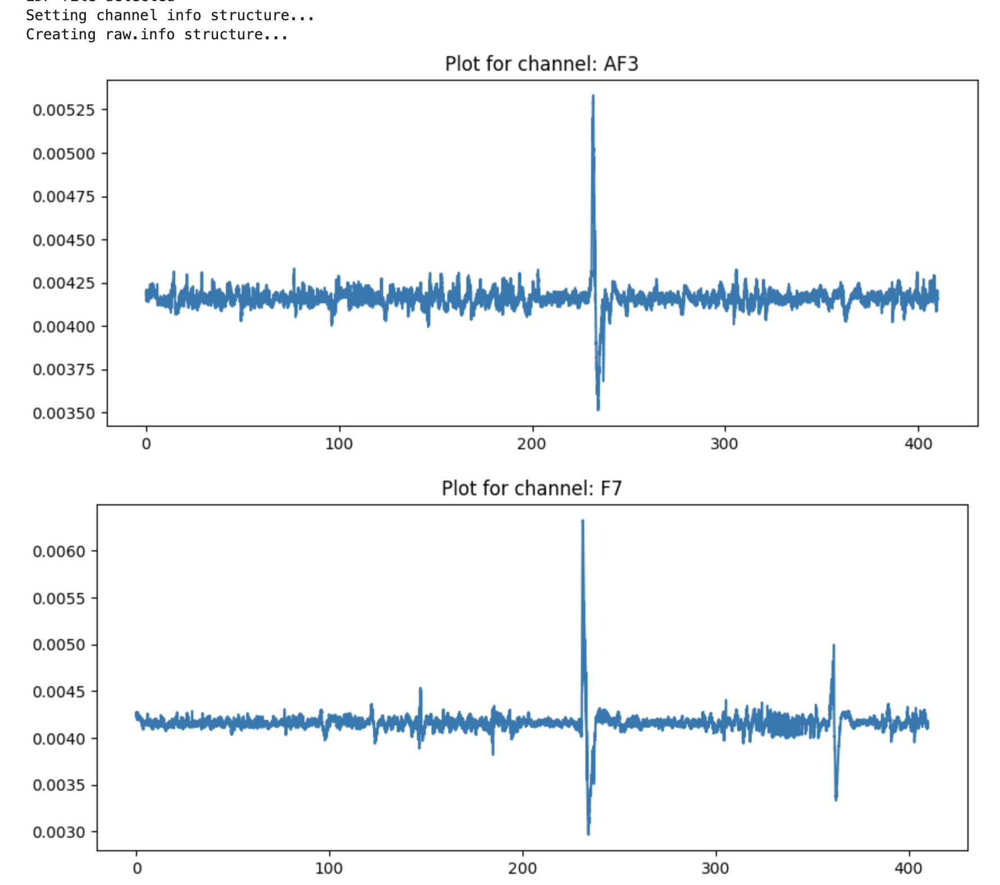
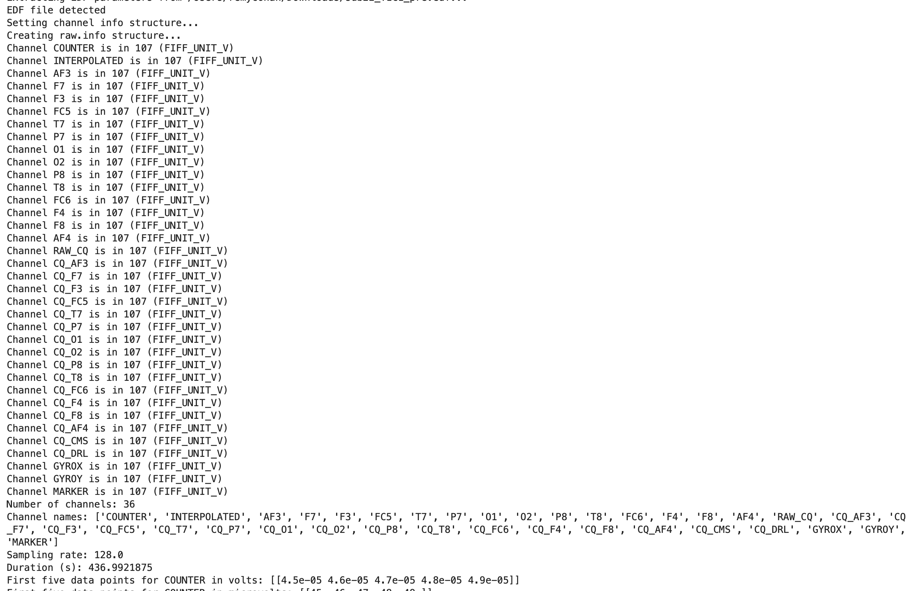

## EEG Data Processing with MNE toolbox

### Overview:
I wrote this code to read, process, and visualise EEG data from a `.edf` file using the MNE library. The data was originally recorded using a 14-channel Emotiv headset. To ensure successful communication between the recording device and the software, a virtual serial port was set up in Testbench utilising COM ports in tandem with the Eltima serial port driver.

### How the Code Works:

1. **Libraries and Modules**
   - `mne`: This is a comprehensive Python library used for processing and analyzing electrophysiological data. 
   - `matplotlib.pyplot`: A standard plotting library in Python.
   - `numpy`: A library for numerical operations in Python.

2. **Loading the EEG Data**:
raw = mne.io.read_raw_edf('/Users/MDPhD/Downloads/sub22_pre.edf')

   This line reads the `.edf` file and loads it into the `raw` object.

3. **Printing Channel Units**:
for ch in raw.info['chs']:
    print(f"Channel {ch['ch_name']} is in {ch['unit']}")

   This loop goes through each channel's info and prints its name and the unit of measurement.

4. **Displaying Basic File Information**:
   The code retrieves and prints basic information about the EEG data such as the number of channels, their names, the sampling rate, and the overall duration of the recording.

5. **Data Points per Channel**:
   For each channel, the code prints out the first five data points both in volts and microvolts.

6. **Annotations**:
annotations = raw.annotations
for annotation in annotations:
    print(annotation)

   This portion extracts annotations present in the EEG file and displays them. Annotations could be events or markers indicating specific moments or events during the recording.

7. **EEG Channel Visualization**:
for channel_name in eeg_channels:
    data, times = raw[channel_name, :int(raw.info['sfreq']*436)]
    ...

   This loop visualizes the EEG data for each specified channel. Each channel's data is plotted over time, providing a clear visual representation of the EEG signals.

8. **Marker Channel Data**:
   The script extracts data from the `MARKER` channel, identifies non-zero values, and prints the times at which these non-zero markers appear. This could be used to indicate specific events or stimuli during the recording.

### Conclusion:
This code offers a comprehensive overview of EEG data by loading, processing, and visualizing its contents. It uses the MNE library to handle the data effectively and produces valuable insights about the recorded EEG signals and their characteristics.

Remy Cohan, 2023
